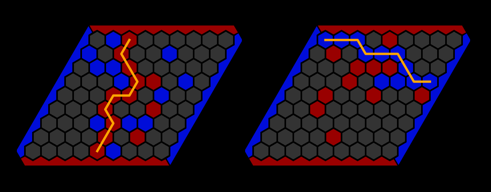
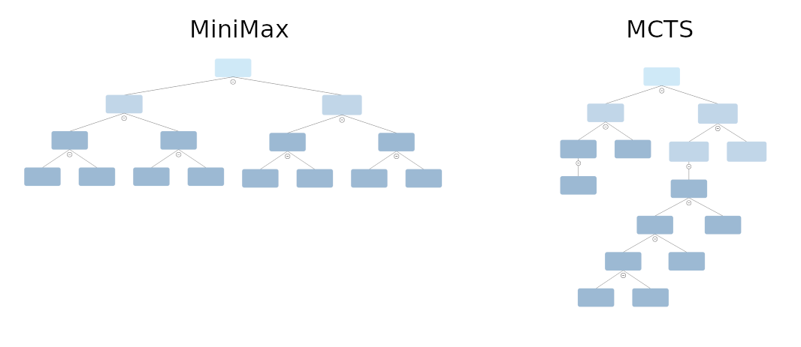

# Hex - Game

## Game Description
The game Hex is an invention of the danish engineer and poet Piet Hein in 1942 and was independently also developed by the mathematician John Nash in 1947. From 1952 onwards, the game was published by Park Brothers. 
Hex is played on a rhombus shaped board where the board size can vary (for example 9x9). Both players take turns placing a stone on an unoccupied space. While the objective of the first player (red) is to connect the north and the south sides of the board, while the second player (blue) aims to connect the east and the west sides of the board. 
Examples where the red player respectively blue player have won:  
 
It is relatively easy to see that at most one player can fulfill the winning condition as the path from e. g. south to north blocks every possible path from west to east. Mathematically it can be shown that with a full board *exactly* one player fulfills the winnings condition. That means that the game never ends in a draw. 

## AI Implementation
Game AIs often base on the MiniMax algorithm which exhaustively searches for the best move in the games states tree. The amount of game states to look at grows exponentially with the depth used in the MiniMax algorithm. The base of the exponetial function (the *branching factor* of the tree) is the number of possible moves which scales with N² where N is the board size. This implies that the MiniMax algorithm is not well-suited for games like Hex (and the same holds true for Go). 
An alternative to MiniMax is Monte Carlo Tree Search (MCTS). While MiniMax has (at least in its basic implementation) a static depth, the MCTS builds heavily upon a dynamical growth of a game states tree. Concretely, if a game state looks promising in the sense that it could be the move later to be chosen by one of the players, it is spent more computational ressources into exploring that state/move. The result is a highly unbalanced / dynamically grown tree.
 
Note that both algorithm require a heuristic to evaluate which playermost likely to win in a given game state. For example, the number of pieces needed to connect the two sides can be taken as a heuristic. The following heuristic works quite well $1/n_r-1/n_b$ where $n_r$ is the number of pieces needed for the red player to connect north and south sides, and analogously $n_b$ is the number of blue pieces to connect the west and east sides. 
For the MCTS algorithm it was usual to utilize rollouts (i. e. playing a game state to the end using random moves) as a heuristic. Note while this works quite well at incremental games like Hex and Go, but at a game like Chess it works miserably. 
However, with AlphaGo in 2016, rollouts where replaced by the game state evaluated of a neural network. Through the utilization of a deep stack of convolutional layers, the network can compute the winning probabilities for both players. This called the value *v*. 
Since the neural network is computationally very demanding, this at first sight reduces the depths of the built tree. However, the neural network also calculates a second quantity, namely the probability $p$ that a game state will be favoured at the termination of the algorithm. This again narrows the effective branching factor of the tree drastically.